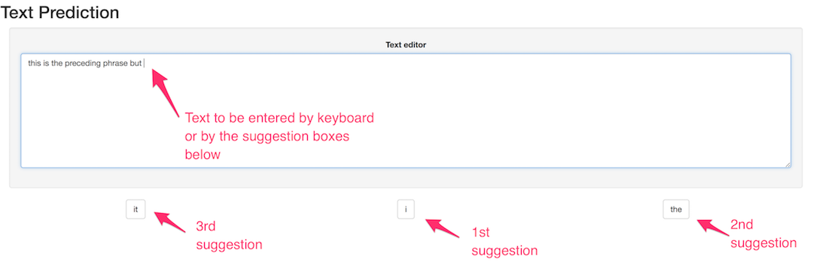

```{r setup, include=FALSE}
knitr::opts_chunk$set(echo = FALSE)
```

## Introduction

This presentation addresses my final project implementation for the
[John Hopkin's Data Science Specialization Capstone](https://www.coursera.org/learn/data-science-project) in 
[Coursera](https://www.coursera.org).

To keep it brief, the following essential items will be addressed:

1. The **prediction algorithm** implemented
2. The **preprocessing performed** as part of the data gathering and cleanup
3. **Instructions** on how to use the app itself
4. **Final comments** about the project and extra information

## Prediction Algorithm

The algorithm implemented to make the text predictions is based on
[Katz's backoff model](https://en.wikipedia.org/wiki/Katz%27s_back-off_model), but
implemented in a simpler straightforward way.

Its inputs are:

- A **phrase** for which to predict the next word
- A **set of N-grams** to use as feeding data

The set of N-grams should be formatted as a list of decreasing order N-grams (`dfm` objects in `quanteda`). The order of these is important since the predictions performed using the higher order N-grams will take precedence over lower order ones.

The algorithm tries to fulfill all the words to predict (3 by default) using the highest order N-gram. If that's not possible (e.g. if the N-gram only contains 2 appearances that match the input phrase), then the algorithm proceeds to predict the rest of the missing words with the next (lower order) N-gram.

## Data Preprocessing

In order to feed the algorithm with the required N-grams, a script called `ngramGen.R` was developed (please refer to the _Resources_ section for more information).

The script works as follows:

1. Reads the 3 provided input files (i.e. `en_US.twitter.txt`, `en_US.news.txt` and `en_US.blogs.txt`).
2. Samples 2.5% of the lines for each file (totalling a 7.5% of the whole provided data set)
3. Performs a cleanup on each of the lines (i.e. number, punctuation, URL and symbol removal).
4. Builds 3 N-grams of order 3, 2 and 1, and gathers them in a `vector`.
5. Stores the N-gram vector in an output file, which is then uploaded to the Shiny server to be used by the prediction algorithm.

## Usage Instructions

The app provides a text editor that holds the text the user inputs, whether directly via the keyboard, or through the buttons that suggest next words.

A new set of word suggestions will be provided whenever the text is updated. You can click any of the buttons below the text editor, which will add the word in the clicked button, and will provide a new set of suggested words based on the new text content.

_Note that upon initial loading there are a few seconds of delay because of data loading._



## Final Comments

- App limitations:
    - Word completion based on partial word input is missing
    - Performance, due to the `quanteda` filtering functions (i.e. `dfm_select`)
    - Reduced phrase context (having a 3-gram as the highest order N-gram is very limiting)
    - `I` and other capitalized words are not properly suggested
- Resources
    - Repository: https://github.com/jverce/ds-finalproject
        - [`scripts/`](https://github.com/jverce/ds-finalproject/tree/master/scripts) contains the data pre-processing script
        - [`model/`](https://github.com/jverce/ds-finalproject/tree/master/model) contains the R package that generates the word suggestions
        - [`shinyapp/`](https://github.com/jverce/ds-finalproject/tree/master/shinyapp) contains the code for the Shiny app
        - [`doc/`](https://github.com/jverce/ds-finalproject/tree/master/doc) contains this presentation
    - NLP library used: [quanteda](https://quanteda.io/)

